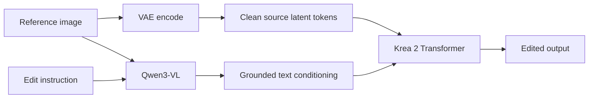

# Krea 2 Identity Edit for Forge Neo 技術解説

## 1. 目的

このextensionは、ComfyUI向けの
[`comfyui-krea2edit`](https://github.com/lbouaraba/comfyui-krea2edit)
が実装するKrea 2 Identity Edit推論を、Stable Diffusion WebUI Forge Neoの
txt2imgパイプラインへ移植する。

Phase 1の対象は次の範囲である。

- Krea 2 Raw / Turbo
- Identity Edit v1.2 LoRA
- 1枚の参照画像
- v1.2の`fit` geometry
- Qwen3-VLによるpositive / negative promptの画像grounding
- txt2img、batch size 1、最大2MP

通常のimg2imgとは異なり、参照画像を初期latentとしてノイズ化するのではない。
出力latentは通常のtxt2imgと同様にノイズから生成し、参照画像はTransformerの
追加clean tokenとQwen3-VLの画像入力として与える。

## 2. 通常のKrea 2との差分

Forge Neoの通常のKrea 2 forwardは、text tokenと生成対象のnoisy target tokenを
次の順番でTransformerへ入力する。

```text
[text | noisy target]
```

単一参照でIdentity Edit LoRAが使用する系列は次のとおりである。

```text
[text | clean source(frame=1) | noisy target(frame=0)]
```

sourceとtargetは同じ画像token形式である。両者の役割は3軸RoPE position IDの
frame軸で区別される。

2参照ではsceneを先、subjectを後に置く。

```text
[text | scene(frame=1) | subject(frame=2) | noisy target(frame=0)]
```

| Token | Frame ID | 役割 |
|---|---:|---|
| text | 0 | 編集指示と画像意味情報 |
| source / scene | 1 | 単一参照、またはsceneのclean VAE latent |
| subject | 2 | 2参照時のsubject clean VAE latent |
| target | 0 | denoise対象の生成latent |

最終層の出力からはtarget token部分だけを取り出す。source tokenは参照情報を
提供するが、直接画像としてdecodeされない。

## 3. 二重conditioning

Identity Editは、参照画像を2つの経路からモデルへ入力する。



### 3.1 Appearance path

参照画像をVAE encodeし、clean source latent tokenとしてKrea 2 Transformerへ
追加する。この経路は色、形状、質感、人物の外見などを保持する。

実装：[`lib_krea2_edit/forward.py`](../lib_krea2_edit/forward.py)

### 3.2 Semantic grounding path

編集指示と参照画像を同時にQwen3-VLへ入力する。この経路により、モデルは
「左側の人物」「奥の看板」など、画像内の対象と指示の関係を理解できる。

text-only encodeでも生成自体は可能だが、Identity Edit LoRAの学習条件と一致せず、
対象の取り違えや編集追従性の低下につながる。

実装：[`lib_krea2_edit/conditioning.py`](../lib_krea2_edit/conditioning.py)

## 4. Forge Neo処理ライフサイクルへの統合

UIとForgeのhookは
[`scripts/krea2_edit.py`](../scripts/krea2_edit.py)で管理する。

```text
Script.process
  ├─ 入力とモデルの検証
  ├─ PIL image -> CPU BHWC float tensor
  ├─ grounding用画像の縮小
  └─ p.setup_condsをjob-localにwrap

LoRA activation
  └─ Forge標準LoRA loaderを使用

p.setup_conds
  ├─ positive grounded encode
  └─ negative grounded encode

Script.process_before_every_sampling
  ├─ LoRA適用後のUnetPatcherをclone
  ├─ Krea2 Edit model wrapperを追加
  └─ sampling開始
```

### 4.1 `process`

`process`はconditioning生成より前に呼ばれる。ここで次を検証する。

- 参照画像が存在する
- 読み込まれたモデルが`backend.diffusion_engine.krea.Krea2`である
- batch sizeが1である
- Hires. fixが無効である
- 出力解像度が2,000,000 pixel以下である

各参照画像は`PIL.Image`から`float32`の`B,H,W,C` tensorへ変換する。値域は
`0.0..1.0`である。

### 4.2 `setup_conds`のjob-local wrapper

Forgeの`Krea2.get_learned_conditioning()`は通常、Qwen engineを画像なしで呼ぶ。
extensionはグローバルなモデルメソッドを恒久的にmonkey patchせず、処理object
`p`の`setup_conds`だけをwrapする。

conditioning構築中のみ、次のproxyへQwen engineを差し替える。

```python
engine(texts)

# proxy経由
engine(texts, images=[reference])
```

`finally`で元のengineへ必ず戻すため、次のjobや通常のKrea 2生成へ画像状態が
漏れない。

positiveとnegativeは同じ参照画像列でencodeされる。Forge標準Qwen engineが空文字を
画像なしのblankへ変換する箇所はjob-localに補正し、空のnegative promptにもvision
tokenを保持する。CFG 1でnegative計算が省略される
場合を除き、CFG > 1でも学習時のunconditional条件と一致させられる。

2参照時はappearance pathと同じ`scene, subject`順でQwenへ渡す。Advanced system
promptが空ならForge標準templateを保持し、指定された場合だけconditioning構築中に
image templateを差し替え、`finally`で復元する。

### 4.3 Qwen vision attention互換adapter

Forge Neoの`backend.attention.attention_function`は、SageAttentionやPyTorch SDPAなどから
選択済みのq/k/v実行関数である。一方、Forgeへ移植されたQwen3-VL vision codeは
ComfyUI側のAPIに従い、最初に次のselector形式で呼ぶ。

```python
optimized_attention = attention_function(device, mask=False, small_input=True)
```

選択済みのForge関数をそのまま呼ぶと、`q`, `k`, `v`, `heads`がないため`TypeError`に
なる。extensionはgrounded encode中だけQwen moduleの参照をselector adapterへ
置き換える。

```python
def select_attention(device, mask=False, small_input=False):
    return forge_attention.attention_function
```

これによりForgeで現在選択されているSage/PyTorch/Flash backendを変更せず利用できる。
adapterはcontext managerの`finally`で復元され、Forge本体や通常生成へ残らない。

### 4.4 Image tokenとprompt emphasisの長さ補正

Qwen tokenizer上では画像は1個のplaceholder tokenだが、vision towerの前処理後には
解像度に応じた多数のembeddingへ展開される。例えば、実測例では139 tokenの入力が
画像展開後に594 embeddingとなる。

Forgeのprompt emphasis処理は元token数の倍率tensorを作るため、そのままでは次の
shape不一致になる。

```text
embeddings:  [1, 594, 2560]
multipliers: [1, 139, 1]
```

grounded encodeでは`process_embeds()`が返す`embeds_info[*].size`を使い、画像placeholder
位置の倍率をvision embedding数だけ複製する。

```text
[text weight, image weight, text weight]
              ↓ image size = N
[text weight, image weight × N, text weight]
```

これにより通常weight `1.0`だけでなく、Forgeのprompt attentionを使った編集指示でも
最終embedding列と倍率列の長さが一致する。この差し替えもgrounded encode中だけ有効で、
終了時に元の`process_tokens`へ復元される。

## 5. Grounding画像の前処理

実装：[`lib_krea2_edit/image_utils.py`](../lib_krea2_edit/image_utils.py)

Qwen3-VLへ渡す画像は、指定された`grounding_px`を最長辺の上限として縮小する。
小さい画像は拡大しない。

```text
reference: 1200 x 600
grounding_px: 768
Qwen input: 768 x 384
```

この解像度はVAE source latentの解像度には影響しない。Qwen3-VLのsemantic path
だけに適用される。

- 低い値：編集指示への追従を優先
- 高い値：人物同一性や細部の認識を優先
- Phase 1既定値：768

## 6. v1.2 `fit` geometry

source画像と出力画像のaspect ratioが異なる場合、latentを直接resizeするとVAE特徴が
ぼける。そのため、Phase 1では必ずpixel空間でgeometryを確定してからVAE encodeする。

### 6.1 近いaspect ratio

差が8%以内なら、最小限のcenter cropを行い、出力pixel grid全体を埋める。

```text
center crop -> bicubic resize -> VAE encode
```

### 6.2 大きく異なるaspect ratio

画像全体が入るようにfit-insideし、学習時のgeometryへ合わせて縦横を16 pixel単位で
floor snapする。

```python
scale = min(target_h / source_h, target_w / source_w)
fit_h = floor(source_h * scale / 16) * 16
fit_w = floor(source_w * scale / 16) * 16
```

生成targetより小さくなったsource token gridは、target grid中央へposition IDを
offsetして配置する。灰色canvasやpadding画像をVAEへ入力するわけではない。

### 6.3 VAE encodeとlatent normalization

処理順は次のとおりである。

```text
BHWC reference
  -> fit_reference_pixels
  -> Forge VAE.encode
  -> vae.first_stage_model.process_in
  -> clean source latent
```

`process_in`はKrea 2が使用するWan系latent formatのmean/std normalizationを適用する。
target latentとsource latentを同一空間へ揃えるために必要である。

encode結果はtarget latentの`(H, W)`ごとにcacheされ、sampling stepごとの再encodeを
避ける。

## 7. Model wrapper

実装：[`lib_krea2_edit/patch.py`](../lib_krea2_edit/patch.py)

Forgeのsampling処理は通常、`KModel.apply_model()`を呼ぶ。Phase 1では
`UnetPatcher.set_model_unet_function_wrapper()`を利用し、次の処理をForge互換で再構成する。

1. sigmaからモデル入力を計算する
2. targetをモデルのcomputation dtypeへ変換する
3. predictorからmodel timestepを得る
4. pixel-fit済みsourceをVAE encodeする
5. `krea2_edit_forward()`を呼ぶ
6. predictorでmodel outputをdenoised predictionへ戻す

LoRA適用後の`UnetPatcher`をcloneするため、Identity Edit LoRAのpatchは保持される。
元のmodel object自体を恒久的に変更しない。

## 8. Forward内部のtensor shape

代表的なshapeを示す。`B=1`、VAE latent channel `C=16`、Krea patch size `P=2`
とする。

| 値 | Shape |
|---|---|
| target latent | `B,C,T,H,W` または `B,C,H,W` |
| 4D target | `B*T,C,H,W` |
| source latent | `B,C,T,Hs,Ws` |
| target tokens | `B,(H/P)*(W/P),features` |
| source tokens | `B,(Hs/P)*(Ws/P),features` |
| Qwen context | `B,seq,12*2560` |
| unpacked context | `B,seq,12,2560` |

結合後の系列は次のshapeになる。

```text
B, text_length + source_length + target_length, features
```

各Transformer blockへ同一系列とRoPE frequencyを渡した後、最終出力を次の範囲で
sliceする。

```python
start = text_length + source_length
output = final[:, start : start + target_length]
```

その後、target tokenだけをlatent画像shapeへ戻す。

## 9. 既存wrapperとの共存

Forgeの`model_function_wrapper`は単一keyで管理される。単純に上書きすると、
Radial Attentionなど先に登録されたwrapperを失う可能性がある。

extensionはpatch前のwrapperを保存し、存在する場合はKrea2 Edit版の
`edit_apply_model`を次のmodel functionとして渡す。

```text
sampling
  -> existing wrapper
      -> edit_apply_model
          -> krea2_edit_forward
```

これにより、「入力やtransformer optionsを調整してからmodel functionを呼ぶ」形式の
Forge wrapperとチェーンできる。モデルforwardそのものを完全に置換するextensionとの
組み合わせは、個別検証が必要である。

## 10. LoRAの扱い

Identity Edit weightはextensionへ同梱しない。Forge標準のLoRA loaderとprompt記法を
利用し、model strength `1.0`で読み込む。

```text
<lora:krea2_identity_edit_v1_2:1>
```

sampling直前に`diffusion_model.loras`が空の場合はwarningを出す。ただし、LoRAが
checkpointへmerge済みの場合もあるため、エラーにはしない。

Krea 2 Identity Edit weightにはコードとは別のモデルライセンスが適用される。

## 11. Phase 1の制約

### txt2imgのみ

この方式は通常のimg2img denoise strengthを使用しない。参照画像はclean tokenとして
注入され、targetはノイズから生成されるため、Phase 1 UIはtxt2imgだけに表示する。

### batch size 1

sourceのbatch展開自体はforward内で可能だが、Qwen画像入力、VRAM消費、Forgeの
Krea/Wan batch処理を含めた品質検証が未完了のため1に制限する。複数生成には
`n_iter`を使用できる。

### Hires. fix無効

二段目samplingでのconditioning再構築、source geometry、モデル切替との組み合わせを
Phase 1では保証しない。最終解像度で生成し、必要なら生成後にupscaleする。

### 最大2MP

学習範囲を大きく超えると、参照内容のbleeding、被写体複製、VRAM急増が起こり得る。
そのため`width * height <= 2,000,000`を必須とする。

## 12. テスト

テストは[`tests/`](../tests/)に置く。

| Test | 検証内容 |
|---|---|
| `test_geometry.py` | near-AR crop、large-AR fit、/16 snap、grounding縮小、mask geometry |
| `test_conditioning.py` | 1/2画像の順序、空negative、system prompt復元、vision token倍率展開、attention API adapter |
| `test_forward.py` | 1/2 sourceのtarget shape、boost no-op、bias列、mask、PyTorch attention |
| `test_patch.py` | 既存model wrapperとのチェーン、2参照・maskの統合 |

Forge Neoのvenvから実行する。

```powershell
$env:PYTHONPATH = @(
  (Resolve-Path .).Path,
  (Resolve-Path ..\stable-diffusion-webui-forge-neo).Path,
  (Resolve-Path ..\stable-diffusion-webui-forge-neo\modules_forge\packages).Path
) -join ';'

..\stable-diffusion-webui-forge-neo\venv\Scripts\python.exe `
  -m unittest discover -s tests -v
```

静的検証：

```powershell
..\stable-diffusion-webui-forge-neo\venv\Scripts\python.exe -m ruff check .
..\stable-diffusion-webui-forge-neo\venv\Scripts\python.exe -m ruff format --check .
```

## 13. Phase 2

Phase 2では次を実装する。

- 2枚目の参照画像とRoPE frame 2
- `ref_boost` / `ref_boost_a`
- reference boost mask
- system prompt override

2参照の場合はsceneをframe 1、subjectをframe 2として扱い、Qwenのvision blockも
同じ順序にする。単一参照時の`ref_boost`は唯一の参照へ、2参照時は最後のsubjectへ
適用する。`ref_boost_a`は2参照時のsceneへ適用する。

boostはtarget queryから該当reference keyへのattention logitへ`log(boost)`を加える。
maskは最後のreference内のkey領域を選択し、referenceと同じfit geometryを適用する。
boost値が両方`1.0`ならattention biasを生成せず、Phase 1と同じ経路を使用する。

## 14. 今後の拡張点

- v1/v1.1向けlegacy `crop`
- API入力
- batch生成
- Hires. fixの明示的対応
- wrapper互換性matrix
- 実モデルによるgolden image regression

## 15. 関連実装

- UIとForge hook：[`scripts/krea2_edit.py`](../scripts/krea2_edit.py)
- Qwen grounding：[`lib_krea2_edit/conditioning.py`](../lib_krea2_edit/conditioning.py)
- 画像geometry：[`lib_krea2_edit/image_utils.py`](../lib_krea2_edit/image_utils.py)
- Forge model patch：[`lib_krea2_edit/patch.py`](../lib_krea2_edit/patch.py)
- Krea2 Edit forward：[`lib_krea2_edit/forward.py`](../lib_krea2_edit/forward.py)
- 使用方法：[`README.md`](../README.md)
